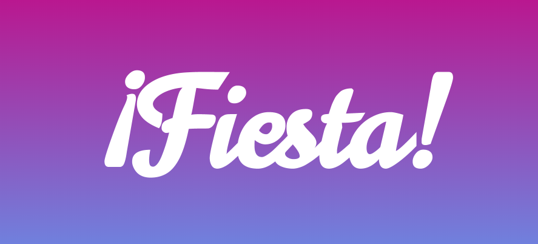

[](https://travis-ci.org/CainiacCombo/Fiesta)

> _¡Fiesta!_ is social platform for viewing, creating, organizing and rating parties.

## Team

  - __Product Owner__: Eric O'Neal
  - __Scrum Master__: Taylor Shephard
  - __Development Team Members__: Cain Watson, Taylor Shepard, Eric O'Neal

## Table of Contents

1. [Wireframe](#wireframe)
1. [Usage](#usage)
1. [Development](#development)
    1. [Installing Dependencies](#installing-dependencies)
    1. [Tasks](#tasks)
1. [Team](#team)
1. [Contributing](#contributing)

## Wireframe
Check out our wireframe [here](https://marvelapp.com/3id7f3c)

## Usage

This project uses the following technologies

- Node 10.0.0
- MySql 14.14
- Ionic 3
- FeathersJS 3.1.7
- Cloudinary
- Twilio

## Development

### Installing Dependencies

```sh
# in the server directory
npm install
npm start

# in the client directory
npm install
npm install --global ionic cordova

ionic serve --lab -lc
```

### Roadmap

View the project roadmap [here](https://github.com/CainiacCombo/Fiesta/issues)

## Contributing

See [CONTRIBUTING.md](/docs/CONTRIBUTING.md) for contribution guidelines.
